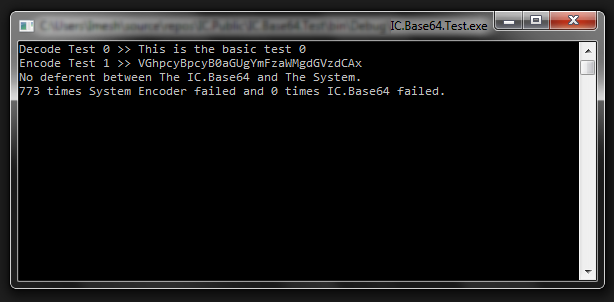

# IC.Base64

This is a simple base64 encoding and decoding library.
The C# has on of those but it won't work correctly.
The System Encode throw `Exception` all the time.
So I programmed this library.

## Author

**Imesh Chamara**

*Email* : [imesh1chamara@gmail.com](mailto:imesh1chamara@gmail.com) , [ic.imesh.chamara@gmail.com](mailto:ic.imesh.chamara@gmail.com)

*Website* : [ic-tech.dx.am](http://ic-tech.dx.am)